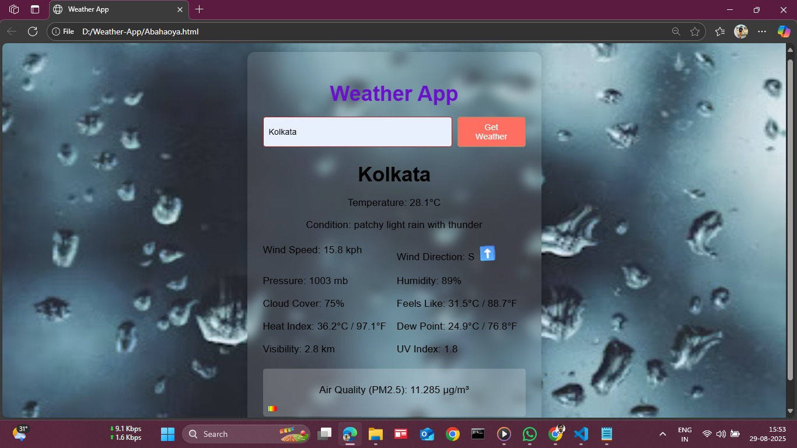

[README.md](https://github.com/user-attachments/files/22043346/README.md)
# 🌦️ Weather App  

A simple and elegant **Weather Application** built with **HTML, CSS, and JavaScript**.  
It fetches real-time weather data using the [OpenWeather API](https://openweathermap.org/api) and displays it with a modern UI and animated gradient backgrounds.  

---

## ✨ Features  
- 🔎 Search weather by **city name**  
- 🌡️ Shows **temperature, humidity, wind speed**  
- 🎨 **Animated gradient background** for a cool visual effect  
- 📱 **Responsive design** (works on desktop & mobile)  
- ⚡ Fast and lightweight (pure HTML, CSS, JS – no frameworks)  

---

## 🖼️ Preview  
  
*(Add a screenshot of your app here once you capture one)*  

---

## 🛠️ Tech Stack  
- **HTML5**  
- **CSS3** (with gradient animations ✨)  
- **JavaScript (Vanilla JS)**  
- **OpenWeather API**  

---

## 🚀 Getting Started  

### 1. Clone the repository  
```bash
git clone https://github.com/your-username/weather-app.git
cd weather-app
```

### 2. Add your OpenWeather API key  
Open `script.js` and replace `YOUR_API_KEY` with your API key from [OpenWeather](https://home.openweathermap.org/users/sign_up).

```javascript
const apiKey = "YOUR_API_KEY";
```

### 3. Run the app  
Open the `index.html` file in your browser, or use **VS Code Live Server**:  
```bash
# If using VS Code
Right click index.html -> "Open with Live Server"
```

---

## 🎨 Customization  
- To change background animations, edit `style.css` → the `linear-gradient` colors & animation keyframes.  
- Replace icons/images in the `assets/` folder to give it your own branding.  

---

## 🤝 Contributing  
Contributions are welcome! If you’d like to improve the design, add features, or fix bugs:  
1. Fork the repo  
2. Create a new branch (`feature-new-idea`)  
3. Commit your changes  
4. Open a pull request 🚀  

---

## 📜 License  
This project is open-source under the [MIT License](LICENSE).  

---

## 👨‍💻 Author  
**Pritam Majumder**  
📧 [Your Email]  
🔗 [LinkedIn](https://linkedin.com/in/your-profile) | [GitHub](https://github.com/your-username)  
